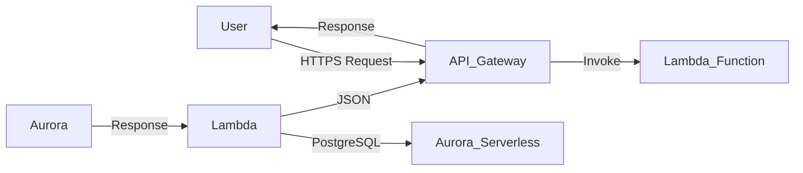

# Análisis Técnico: Migración de localStorage a Backend Real

## Estado actual del backend

- [x] FastAPI + PostgreSQL + SQLAlchemy 2.0 + Pydantic v2 + PyJWT en Docker (`docker compose up`)
- [x] Auth JWT real con **Argon2id** (pwdlib): `login`, `register`, `refresh`, `logout`, `me` + CRUD de usuarios (admin)
- [x] Tablas: `users`, `revoked_tokens` (revocación de refresh token por `jti`) + seed del usuario admin
- [x] Catálogos FASE 4: providers, products, clients, movements
- [x] Documentos FASE 4: quotations, sales, purchase-orders, stock-requests, provider-quotations
- [x] settings
- [x] reports, audit-log
- [ ] Rate limiting (sección 11), formato de error estándar (sección 10), Alembic (FASE 2) — **diferidos** (decisión del proyecto)

## 1. Estructura del Proyecto

**Framework**: React 19 + Vite + Ionic React v8 + Redux Toolkit v2  
**Routing**: React Router v5 (Ionic integration)  
**State Management**: Redux Toolkit con 9 slices (auth, products, movements, providers, clients, quotes, sales, settings, auditLog)  
**UI Components**: Ionic components (IonPage, IonButton, IonIcon, etc.)  
**Authentication**: JWT tokens mock generados en localStorage  
**Testing**: Vitest + Playwright E2E tests  

**Directorios clave**:
- `src/services/localStorage/storageEngine.ts` — Motor de persistencia central (2420 líneas)
- `src/services/localStorage/seedData.ts` — Datos seed (544 líneas)
- `src/api/` — 11 archivos API wrapper (todos delegan a StorageEngine)
- `src/store/slices/` — 9 rebanadas Redux
- `src/types/` — Interfaces TypeScript para todas las entidades
- `src/pages/` — 30+ páginas organizadas por dominio (inventario, ventas, compras, reportes, usuarios, configuración)
- `src/components/` — Componentes UI reutilizables

## 2. Uso de localStorage (Auditoría Completa)

Todas las 11 API `src/api/*Api.ts` delegan a `StorageEngine`. Las keys utilizadas:

| Key | Entidad | Datos Persistidos |
|-----|---------|-------------------|
| `abacubiertas_users` | Users | Registros de usuario con password_hash, roles, estado activo |
| `abacubiertas_providers` | Providers | Registros de proveedor (NIT, contacto, teléfono, email, dirección, categorías) |
| `abacubiertas_products` | Products | Registros de producto con stock, precios, enlaces proveedor |
| `abacubiertas_clients` | Clients | Registros de cliente (NIT/CC, contacto, tipo, estado) |
| `abacubiertas_quotations` | Quotations | Registros de cotización con detalles/cálculo de margen |
| `abacubiertas_sales` | Sales | Órdenes de venta con seguimiento de estado, confirmación de despacho |
| `abacubiertas_pos` | Purchase Orders | Órdenes de compra con seguimiento de recepción, flujo de aprobación |
| `abacubiertas_stock_requests` | Stock Requests | Solicitudes de abastecimiento vinculadas a productos con stock bajo |
| `abacubiertas_provider_quotations` | Provider Quotations | Múltiples cotizaciones por solicitud para selección de proveedor |
| `abacubiertas_audit_log` | Audit Log | Log de operaciones con marcas de tiempo y usuario atribuido |
| `accessToken` / `refreshToken` | Auth | Tokens JWT mock |

**Operaciones realizadas en localStorage**:
- Crear, leer, actualizar, eliminar (CRD para la mayoría de entidades)
- Generación auto de IDs (patrón Math.max+1)
- Generación de timestamps (new Date().toISOString())
- Eliminación blanda (set `activo: false` o `estado: 'inactivo'`)
- Lógica de negocio (recalculo de stock, cálculos de margen, transiciones de estado)
- Registro de auditoría
- Hasheo de contraseñas (hash simple, propósito demo)
- Bandera de inicialización en primer carga

## 3. Identificación de Entidades y Mapeo al Backend

### 3.1 Users
- **Campos**: id_usuario, email, nombre, rol, activo, password_hash
- **Responsabilidad backend**: Autenticación, almacenamiento de contraseñas (bcrypt/argon2), gestión de roles, activación de cuenta

### 3.2 Providers
- **Campos**: id_proveedor, nombre_empresa, nit, contacto, teléfono, email, dirección, ciudad, categoria_material, condiciones_pago, observaciones, estado, activo, creado_en, actualizado_en
- **Responsabilidad backend**: CRUD, unicidad de NIT, gestión de estado (soft delete → estado='inactivo')

### 3.3 Products
- **Campos**: id_producto, nombre, descripcion, unidad_medida, precio_unitario, stock_actual, stock_minimo, id_proveedor, nombre_proveedor, activo, status, low_stock
- **Responsabilidad backend**: CRUD, gestión de stock, detección de stock bajo, seguimiento de movimientos, eliminación blanda

### 3.4 Clients
- **Campos**: id_cliente, tipo_cliente, nombre_razón_social, nit_cc, nombre_contacto, teléfono, email, dirección, ciudad, observaciones, estado, activo, created_at, updated_at
- **Responsabilidad backend**: CRUD, unicidad NIT/CC, gestión de estado

### 3.5 Quotations
- **Campos**: id_cotizacion, numero_consecutivo, id_cliente, id_usuario, fecha_emisión, fecha_vencimiento, estado, subtotal, impuestos, descuento, total, observaciones, detalles[]
- **Responsabilidad backend**: CRUD, seguimiento de estado (borrador→enviada→aprobada/rechazada, enforcement en backend), cálculo de margen (configurable vía `system_settings.margen_utilidad_default`, default 30%), numeración consecutiva COT-NNNN — **implementado**

### 3.6 Sales/Orders
- **Campos**: id_orden_venta, numero_orden, id_cliente, id_cotización, id_usuario, fecha_venta, estado, subtotal, impuestos, total (con IVA 19%), observaciones, detalles[]
- **Responsabilidad backend**: CRUD, deducción de stock en confirm-dispatch, cancelación con restauración de stock, máquina de estado (pendiente→en_proceso→entregada→cancelada) — **implementado**

### 3.7 Purchase Orders
- **Campos**: id_orden_compra, numero_oc, id_proveedor, nombre_proveedor, fecha_emisión, estado, observaciones, id_solicitud, numero_solicitud, id_cotización, detalles[]
- **Responsabilidad backend**: CRUD, flujo de aprobación (habilitada por configuración + monto mínimo), marcar como tránsito, recibir mercancía, máquina de estado (enviada→en_transito→recibida, pendiente_aprobacion, rechazada) — **implementado**

### 3.8 Stock Requests
- **Campos**: id_solicitud, numero_solicitud, id_producto, descripcion, cantidad_sugerida, stock_actual, stock_minimo, estado, fecha, id_usuario, nombre_usuario, observaciones
- **Responsabilidad backend**: CRUD, flujo de estado (pendiente→aprobada→atendida/rechazada), enlace a productos/proveedores

### 3.9 Provider Quotations
- **Campos**: id_cotizacion, numero_cotizacion, id_solicitud, id_producto, id_proveedor, nombre_proveedor, precio_unitario, tiempo_entrega_dias, condiciones, fecha, seleccionada
- **Responsabilidad backend**: CRUD, lógica de selección (mínimo 2 cotizaciones por solicitud), enlace a solicitudes y productos

### 3.10 Audit Log
- **Campos**: id, fecha, id_usuario, nombre_usuario, rol_usuario, accion, detalle
- **Responsabilidad backend**: Almacenamiento de log inmutable, capacidades de búsqueda/filtro

### 3.11 System Settings
- **Campos**: stockMinimoDefault, margenUtilidadDefault, catalogoInicialCargado, aprobacionOcHabilitada, aprobacionOcMontoMinimo, updatedAt
- **Responsabilidad backend**: Registro de configuración único (fila id=1), reglas de validación; alimenta el margen de utilidad de las cotizaciones y la regla de aprobación de órdenes de compra — **implementado**

### Estado backend por entidad

| Entidad | Estado |
|---------|--------|
| 3.1 Users | [x] Implementado |
| 3.2 Providers | [x] Implementado |
| 3.3 Products | [x] Implementado |
| 3.4 Clients | [x] Implementado |
| 3.5 Quotations | [x] Implementado |
| 3.6 Sales/Orders | [x] Implementado |
| 3.7 Purchase Orders | [x] Implementado |
| 3.8 Stock Requests | [x] Implementado |
| 3.9 Provider Quotations | [x] Implementado |
| 3.10 Audit Log | [x] Implementado |
| 3.11 System Settings | [x] Implementado |

## 4. Responsabilidades del Backend

### Funcionalidades que Deben Moverse al Backend:

| Funcionalidad | Ubicación Actual | Necesaria en Backend |
|--------------|-----------------|---------------------|
| Autenticación/login | StorageEngine + JWT mock | **Sí** — JWT auth con refresh tokens |
| Registro de usuario | StorageEngine | **Sí** — Con hash de contraseña real |
| Verificación de contraseña | StorageEngine (hash simple) | **Sí** — Backend debe usar bcrypt/argon2 |
| CRUD Producto + actualizaciones de stock | StorageEngine | **Sí** — Con operaciones atómicas de stock |
| Entradas/salidas/ajustes de movimiento | StorageEngine | **Sí** — Con validación de suficiencia de stock |
| CRUD Proveedor | StorageEngine | **Sí** — Con unicidad de NIT |
| CRUD Cliente | StorageEngine | **Sí** — Con unicidad de NIT/CC |
| Creación de cotización + cálculo de margen | StorageEngine | **Sí** — Lógica de margen puede permanecer frontend pero mejor en backend |
| Creación de venta + confirmación de despacho | StorageEngine | **Sí** — Deducción de stock es lógica crítica |
| Creación de orden de compra | StorageEngine | **Sí** — Flujo de aprobación depende de configuraciones |
| Recibir contra PO | StorageEngine | **Sí** — Entrada de inventario + movimiento |
| Flujo de aprobación | StorageEngine + configuraciones | **Sí** — Autoridad del backend |
| Creación solicitud de stock | StorageEngine | **Sí** — Enlace a productos con stock bajo |
| Selección cotización proveedor | StorageEngine | **Sí** — Mínimo 2 cotizaciones por solicitud |
| Cálculo KPIs del dashboard | StorageEngine | **Sí** — Mejor con datos reales |
| Registro de auditoría | StorageEngine | **Sí** — Log de auditoría persistente |
| Gestión de configuraciones | StorageEngine | **Sí** — Configuración persistente |

### Estado que Puede Permanecer en Frontend:
- **Estado UI**: diálogos abiertos/cerrados, estado de validación de forms, estado de selección temporal
- **Cache/local cache**: cacheo de lectura para datos frecuentemente accedidos
- **Estado de formulario**: datos temporales antes de guardar
- **Estado de sesión**: datos temporales de sesión que no requieren persistencia

### Datos que Deben Venir del Backend:
- Todos los datos de entidad persistentes (usuarios, productos, proveedores, clientes, etc.)
- IDs (generados por backend, no Math.max+1)
- Timestamps (creación/modificación)
- Valores generados (números de orden, números de cotización, etc.)
- Aplicación de reglas de negocio (validaciones, aprobaciones, checks de stock)

## 5. Contrato de API Definido

El frontend usa actualmente estos patrones API (todos envolviendo StorageEngine). El backend debe exponer endpoints equivalentes:

### Endpoints de Autenticación
- [x] `POST /api/v1/auth/login` — Login con email/password, retornar JWT access/refresh tokens
- [x] `POST /api/v1/auth/register` — Registrar nuevo usuario (solo admin)
- [x] `POST /api/v1/auth/refresh` — Refrescar access token usando refresh token
- [x] `GET /api/v1/auth/me` — Obtener info de usuario actual (protegido)
- [x] `POST /api/v1/auth/logout` — Revocar refresh token (denylist por jti); access caduca en 15 min

### Endpoints de Usuarios
- [x] `GET /api/v1/users` — Listar usuarios con filtros (rol, status) y paginación
- [x] `GET /api/v1/users/:id` — Obtener usuario por ID
- [x] `PATCH /api/v1/users/:id` — Actualizar usuario (solo admin)
- [x] `DELETE /api/v1/users/:id` — Desactivar usuario (solo admin, soft delete)

### Endpoints de Productos
- [x] `GET /api/v1/products` — Listar con paginación, búsqueda, filtros opcionales (estado, id_proveedor)
- [x] `GET /api/v1/products/:id` — Obtener producto por ID
- [x] `POST /api/v1/products` — Crear producto (backend genera id_producto)
- [x] `PATCH /api/v1/products/:id` — Actualizar producto
- [x] `DELETE /api/v1/products/:id` — Delete/soft-delete producto

### Endpoints de Proveedores
- [x] `GET /api/v1/providers` — Listar con paginación, búsqueda/filtro opcional
- [x] `GET /api/v1/providers/:id` — Obtener proveedor por ID
- [x] `POST /api/v1/providers` — Crear proveedor (backend genera id_proveedor)
- [x] `PATCH /api/v1/providers/:id` — Actualizar proveedor
- [x] `DELETE /api/v1/providers/:id` — Eliminación blanda (set estado='inactivo')

### Endpoints de Clientes
- [x] `GET /api/v1/clients` — Listar con paginación, búsqueda, filtros (estado, tipo)
- [x] `GET /api/v1/clients/:id` — Obtener cliente por ID
- [x] `POST /api/v1/clients` — Crear cliente (backend genera id_cliente)
- [x] `PATCH /api/v1/clients/:id` — Actualizar cliente
- [x] `DELETE /api/v1/clients/:id` — Eliminación blanda (set estado='inactivo')

### Endpoints de Movimientos de Inventario
- [x] `GET /api/v1/movements` — Listar movimientos (filtros por producto y rango de fechas)
- [x] `POST /api/v1/movements/entry` — Entrada de stock
- [x] `POST /api/v1/movements/output` — Salida de stock (valida suficiencia)
- [x] `POST /api/v1/movements/adjustment` — Ajuste de stock (fija stock_actual)

### Endpoints de Cotizaciones
- [x] `GET /api/v1/quotations` — Listar con paginación, filtros (id_cliente, estado)
- [x] `GET /api/v1/quotations/:id` — Obtener cotización por ID
- [x] `POST /api/v1/quotations` — Crear cotización (backend genera id_cotizacion)
- [x] `PATCH /api/v1/quotations/:id` — Actualizar cotización
- [x] `PATCH /api/v1/quotations/:id/estado` — Actualizar estado
- [x] `DELETE /api/v1/quotations/:id` — Eliminar cotización

### Endpoints de Ventas/Órdenes
- [x] `GET /api/v1/sales` — Listar con paginación, filtros (id_cliente, estado)
- [x] `GET /api/v1/sales/:id` — Obtener venta por ID
- [x] `POST /api/v1/sales` — Crear venta (backend no deduce stock; lo hace confirm-dispatch)
- [x] `PATCH /api/v1/sales/:id` — Actualizar estado (máquina: pendiente→en_proceso→entregada) y observaciones
- [x] `POST /api/v1/sales/:id/cancel` — Cancelar venta con restauración de stock (movimiento entrada `REVERSIÓN {numero}`)
- [x] `POST /api/v1/sales/:id/confirm-dispatch` — Confirmar despacho físico, deducir stock (admin+bodega)
- [x] `POST /api/v1/quotations/:id/convert-to-sale` — Convertir cotización aprobada en venta pendiente

### Endpoints de Órdenes de Compra
- [x] `GET /api/v1/purchase-orders` — Listar con paginación, filtrar por estado
- [x] `GET /api/v1/purchase-orders/:id` — Obtener PO por ID
- [x] `POST /api/v1/purchase-orders` — Crear orden de compra (desde solicitud + cotización)
- [x] `POST /api/v1/purchase-orders/:id/mark-transit` — Marcar como en_transito
- [x] `POST /api/v1/purchase-orders/:id/receive` — Recibir mercancía, actualizar stock (parcial permitido)
- [x] `POST /api/v1/purchase-orders/:id/approve` — Aprobar/rechazar PO pendiente de aprobación
- [x] `GET /api/v1/purchase-orders/pending-approval` — Listar POs pendientes de aprobación

### Endpoints de Solicitudes de Stock
- [x] `GET /api/v1/stock-requests` — Listar con paginación, filtrar por estado
- [x] `GET /api/v1/stock-requests/:id` — Obtener solicitud por ID
- [x] `POST /api/v1/stock-requests` — Crear solicitud de stock (para productos con stock bajo)
- [x] `PATCH /api/v1/stock-requests/:id/status` — Actualizar estado

### Endpoints de Cotizaciones de Proveedor
- [x] `GET /api/v1/provider-quotations` — Listar con paginación, filtrar por id_solicitud
- [x] `GET /api/v1/provider-quotations/:id` — Obtener por ID
- [x] `POST /api/v1/provider-quotations` — Crear cotización para solicitud de stock
- [x] `PATCH /api/v1/provider-quotations/:id/seleccionar` — Marcar como seleccionada

### Endpoints de Reportes
- [x] `GET /api/v1/reports/kpis` — KPIs del dashboard
- [x] `GET /api/v1/reports/sales-by-seller` — Ventas por vendedor
- [x] `GET /api/v1/reports/sales-monthly-trend` — Tendencia mensual de ventas
- [x] `GET /api/v1/reports/inventory-valuation` — Valoración de inventario
- [x] `GET /api/v1/reports/provider-expense` — Gasto por proveedor
- [x] `GET /api/v1/reports/provider-delivery` — Tiempos de entrega de proveedores

### Endpoints de Configuración
- [x] `GET /api/v1/settings` — Obtener configuración del sistema
- [x] `PATCH /api/v1/settings` — Actualizar configuración del sistema (solo admin)
- [x] `POST /api/v1/settings/reset` — Restablecer a valores por defecto (solo admin)

### Endpoints de Log de Auditoría
- [x] `GET /api/v1/audit-log` — Listar con paginación, filtros (usuario, acción)
- [x] `DELETE /api/v1/audit-log` — Limpiar log de auditoría (solo admin)

## 6. Esquema de Base de Datos Propuesto

### Relación Entidad-Relación General:

```
Users (1:M) → Sales
Users (1:M) → Purchase Orders
Users (1:M) → Quotations
Users (1:M) → Audit Log
Users (1:M) → Stock Requests
Users (1:M) → Providers (asignados)

Providers (1:M) → Products
Providers (1:M) → Purchase Orders
Providers (1:M) → Provider Quotations

Products (1:M) → Movements
Products (1:M) → Purchase Order Details
Products (1:M) → Stock Requests
Products (1:M) → Sales Details

Clients (1:M) → Sales
Clients (1:M) → Quotations

Quotations (1:M) → Sales (via id_cotizacion)
Stock Requests (1:M) → Provider Quotations
Stock Requests (1:M) → Products

Purchase Orders (1:M) → Purchase Order Details
Purchase Orders (1:M) → Providers
Purchase Orders (1:M) → Stock Requests (via id_solicitud)
Purchase Orders (1:M) → Provider Quotations (via id_cotizacion)
```

### Tablas:

#### 1. users
- id (PK, auto-increment o uuid)
- email (unique, not null)
- password_hash (not null, bcrypt)
- nombre (not null)
- rol (enum: admin, ventas, compras, bodega, gerencia, not null)
- activo (boolean, default true)
- created_at (timestamp)
- updated_at (timestamp)

#### 2. providers
- id (PK, auto-increment)
- nombre_empresa (not null)
- nit (unique, not null)
- contacto
- teléfono
- email
- direccion
- ciudad
- categoria_material (enum o varchar)
- condiciones_pago
- observaciones
- estado (enum: activo, inactivo, preferente, default: activo)
- creado_en (timestamp)
- actualizado_en (timestamp)

#### 3. products
- id (PK, auto-increment)
- nombre (not null)
- descripcion
- unidad_medida (not null)
- precio_unitario (decimal, not null)
- stock_actual (integer, default 0, not null)
- stock_minimo (integer, default 15, not null)
- id_proveedor (FK → providers.id)
- nombre_proveedor (denormalized, varchar)
- activo (boolean, default true)
- status (enum: low, normal, default: normal)
- low_stock (boolean, computed o almacenado)
- creado_en (timestamp)
- actualizado_en (timestamp)

#### 4. clients
- id (PK, auto-increment)
- tipo_cliente (enum: empresa, persona_natural, not null)
- nombre_razon_social (not null)
- nit_cc (unique, not null)
- nombre_contacto
- teléfono
- email
- direccion
- ciudad
- observaciones
- estado (enum: activo, inactivo, prospecto, frecuente, corporativo, default: activo)
- activo (boolean, default true)
- created_at (timestamp)
- updated_at (timestamp)

#### 5. quotations
- id (PK, auto-increment)
- numero_consecutivo (generado: COT-NNNN)
- id_cliente (FK → clients.id, not null)
- id_usuario (FK → users.id, not null)
- fecha_emision (timestamp, not null)
- fecha_vencimiento (timestamp)
- estado (enum: borrador, enviada, aprobada, rechazada, vencida, default: borrador)
- subtotal (decimal, not null)
- impuestos (decimal, not null, 19% IVA)
- descuento (decimal, default 0)
- total (decimal, not null)
- observaciones
- creado_en (timestamp)
- actualizado_en (timestamp)

#### 6. sales (header)
- id (PK, auto-increment)
- numero_orden (generado: PED-NNNN)
- id_cliente (FK → clients.id, not null)
- id_cotizacion (FK → quotations.id, opcional)
- id_usuario (FK → users.id, not null)
- fecha_venta (timestamp, not null)
- estado (enum: pendiente, en_proceso, entregada, cancelada, default: pendiente)
- total (decimal, not null)
- observaciones
- creado_en (timestamp)

#### 7. sale_details
- id (PK, auto-increment)
- id_venta (FK → sales.id, not null)
- id_producto (FK → products.id, not null)
- cantidad (integer, not null)
- precio_unitario (decimal, not null)
- descuento (decimal, default 0)
- subtotal (decimal, computed)

#### 8. movements (movimientos de inventario)
- id (PK, auto-increment)
- id_producto (FK → products.id, not null)
- tipo (enum: entrada, salida, ajuste, not null)
- cantidad (integer, not null)
- referencia (varchar, not null — ej: número de orden)
- id_usuario (FK → users.id, not null)
- nombre_usuario (varchar, denormalized)
- fecha (timestamp, not null)
- nota (varchar)

#### 9. purchase_orders (header)
- id (PK, auto-increment)
- numero_oc (generado: OC-NNNN)
- id_proveedor (FK → providers.id, not null)
- fecha_emision (timestamp, not null)
- estado (enum: enviada, en_transito, recibida, pendiente_aprobacion, rechazada, default: enviada)
- observaciones
- id_solicitud (FK → stock_requests.id, opcional)
- id_cotizacion (FK → quotations.id, opcional)
- creado_en (timestamp)

#### 10. purchase_order_details
- id (PK, auto-increment)
- id_oc (FK → purchase_orders.id, not null)
- id_producto (FK → products.id, not null)
- cantidad_ordenada (integer, not null)
- cantidad_recibida (integer, default 0, not null)
- precio_unitario (decimal, not null)
- tiempo_entrega_dias (integer, opcional)

#### 11. stock_requests
- id (PK, auto-increment)
- numero_solicitud (generado: SOL-NNNN)
- id_producto (FK → products.id, not null)
- descripcion (varchar, denormalized)
- cantidad_sugerida (integer, not null)
- stock_actual (integer, denormalized)
- stock_minimo (integer, denormalized)
- estado (enum: pendiente, aprobada, atendida, rechazada, default: pendiente)
- fecha (timestamp, not null)
- id_usuario (FK → users.id, not null)
- nombre_usuario (varchar, denormalized)
- observaciones

#### 12. provider_quotations
- id (PK, auto-increment)
- numero_cotizacion (generado: COT-NNNN)
- id_solicitud (FK → stock_requests.id, not null)
- id_producto (FK → products.id, not null)
- id_proveedor (FK → providers.id, not null)
- precio_unitario (decimal, not null)
- tiempo_entrega_dias (integer, not null)
- condiciones
- fecha (timestamp, not null)
- seleccionada (boolean, default false)

#### 13. audit_log
- id (PK, auto-increment)
- id_usuario (FK → users.id, opcional — acciones de admin pueden no tener usuario)
- nombre_usuario (varchar, denormalized)
- email_usuario (varchar)
- rol_usuario (enum)
- accion (varchar, not null — ej: "product_created", "user_login", "sale_dispatched")
- detalle (text, not null)
- fecha (timestamp, not null)

#### 14. system_settings (una sola fila)
- id (PK, o usar fila 1)
- stock_minimo_default (integer, default 15)
- margen_utilidad_default (integer, default 30, 0-100)
- catalogo_inicial_cargado (boolean, default false)
- aprobacion_oc_habilitada (boolean, default false)
- aprobacion_oc_monto_minimo (decimal, default 5000000)
- updated_at (timestamp)

### Índices y Constraints:
- Único: users.email, providers.nit, clients.nit_cc
- Índices FK: todas las columnas de foreign key
- Product: índice en `activo`, `low_stock` (para queries críticas)
- Movement: índice en `id_producto`, `fecha` (para reports)
- Purchase Order: índice en `estado`, `id_proveedor`
- Stock Request: índice en `estado`, `id_producto`
- Quotation: índice en `id_cliente`, `estado`

## 7. Reglas de Negocio Extraídas del Frontend

| Regla | Ubicación Actual | Destino |
|-------|-----------------|---------|
| Contraseña debe ser ≥8 caracteres | authSlice | **Backend** — Debe enforcarse con bcrypt |
| Validación de nombre/NIT/CC duplicado | Frontend (StorageEngine) | **Backend** — Constraint única en BD |
| Detección automática low_stock cuando stock_actual ≤ stock_minimo | Frontend (StorageEngine createProduct/createEntry) | **Backend** — Puede ser computed o trigger |
| Check de suficiencia de stock antes de salida movimiento | Frontend (StorageEngine createOutput) | **Backend** — Crítico, nunca debe confiarse en frontend |
| Creación automática movimiento inicial cuando product creado con stock_inicial > 0 | Frontend (StorageEngine createProduct) | **Backend** — Puede ser trigger DB o comportamiento API |
| Flujo de aprobación: si aprobacionOcHabilitada + total >= aprobacionOcMontoMinimo → pendiente_aprobacion | Frontend + settings | **Backend** — Autoridad para lógica de aprobación |
| Mínimo 2 cotizaciones requeridas para seleccionar una por solicitud de stock | Frontend (StorageEngine selectProviderQuotation) | **Backend** — Enforcer en API |
| Eliminación blanda: productos con movimientos → set activo=false; sin movimientos → hard delete | Frontend (StorageEngine deleteProduct) | **Backend** — Enforcer via constraints FK / soft delete |
| Activación/desactivación de usuario | Frontend (authSlice + StorageEngine) | **Backend** — Autoridad sobre estado de usuario |
| Transición de estado de cotización (borrador→enviada→aprobada/rechazada/vencida) | Frontend (StorageEngine updateQuoteStatus) | **Backend** — Máquina de estado |
| Máquina de estado de venta (pendiente→en_proceso→entregada→cancelada) con deducción de stock al confirm-dispatch | Frontend (StorageEngine createSale/confirmDispatch) | **Backend** — Lógica crítica de negocio |
| Registro de auditoría en cada operación significativa | Frontend (StorageEngine recordAuditLog) | **Backend** — Auditoría centralizada |
| Cálculo de margen por defecto (30% por config) | Frontend (applyDefaultMargin) | **Backend** — Configurable desde settings |

## 8. Autenticación y Autorización

### Autenticación Actual en Frontend:
- Login → StorageEngine.login → token JWT mock con payload (email, rol, id, nombre, etc.)
- Token almacenado en localStorage como `accessToken`
- Refresh token almacenado como `refreshToken`
- `getCurrentUserFromToken()` analiza payload del JWT
- authSlice Redux almacena user + tokens
- ProtectedRoute verifica `isAuthenticated`
- AdminRoute verifica `user?.rol === 'admin'`
- SalesRoute probably checks for ventas/gerencia roles

### Autenticación Requerida en Backend:
- **Mecanismo**: JWT con HS256 (o RSA si necesario)
- **Endpoint login**: Retorna `access_token` (corto, 15 min) + `refresh_token` (largo, 7 días)
- **Almacenamiento de contraseñas**: bcrypt o argon2 (NO el hash simple usado actualmente)
- **Middleware de validación**: Validar JWT en rutas protegidas, adjuntar `req.user`
- **Refresh**: POST /auth/refresh con refresh_token → nuevo access_token
- **Acceso basado en roles**:
  - `admin`: Acceso total (usuarios, configuraciones, todas las entidades) [x]
  - `gerencia`: Reportes, configuraciones, gestión de catálogo
  - `ventas`: Cotizaciones, clientes, ventas (propia data)
  - `compras`: Proveedores, solicitudes de stock, órdenes de compra
  - `bodega`: Movimientos, inventario, operaciones de stock

**Estado RBAC**: `admin` enforceado (`require_admin` en users/register). RBAC por módulo con dep `require_roles(...)` implementado para: providers/products (admin+compras), clients (admin+ventas), movements (admin+bodega), quotations (admin+ventas; lecturas para cualquier autenticado), sales (writes/cancel admin+ventas, confirm-dispatch admin+bodega, lecturas cualquier autenticado), purchase-orders (create/mark-transit admin+compras, receive admin+bodega, approve/pending-approval admin+gerencia, lecturas cualquier autenticado), stock-requests (writes admin+compras, lecturas autenticado), provider-quotations (writes/seleccionar admin+compras, lecturas autenticado), reports (lectura admin+gerencia), audit-log (lectura admin+gerencia, DELETE solo admin), settings (writes admin).

### Cambios Frontend Necesarios para Auth:
- Reemplazar `localStorage.getItem('accessToken')` con servicio auth llamando a `/api/v1/auth/login`
- Reemplazar almacenamiento de token en Redux con estado autenticado desde backend
- Agregar interceptor auth (axios) para inyección automática de headers
- Manejar 401 → redirect a login, flujo de refresh de token
- Remover generación de mock token (`createMockToken` en StorageEngine)
- Remover `localStorage.setItem('accessToken')` / `removeItem` calls

## 9. Validaciones

### Validaciones Frontend Que También Deben Existir en Backend:

| Validación | Frontend Actual | Requisito Backend |
|------------|-----------------|-------------------|
| Contraseña ≥8 caracteres | authSlice login | **Crítico** — Nunca confiar en frontend |
| Email único en registro de usuario | authSlice register + StorageEngine | **Sí** — Constraint única en BD |
| NIT único en creación de proveedor | providerApi/createProvider | **Sí** — Constraint única en BD |
| NIT/CC único en creación de cliente | clientApi/createClient | **Sí** — Constraint única en BD |
| Nombre de producto duplicado | productApi/createProduct | **Sí** — Unique constraint en DB |
| Formato de email | providerApi, clientApi, auth | **Sí** — Puede validarse frontend también, pero backend no debe confiar |
| Cantidad > 0 en entradas/salidas | movementApi createEntry/createOutput | **Sí** — Crítico para control de stock |
| Check de suficiencia de stock | movementApi createOutput | **Sí** — Nunca permitir stock negativo |
| Formato NIT/CC | clientApi/createClient | **Sí** — BD puede enforcer patrón |

### Validaciones Solo Frontend (seguras de mantener):
- Formatting UI (máscaras, styling de inputs)
- Validación temporal de campos antes de submit
- Validaciones de experiencia de usuario (mensajes de advertencia, no detenciones duras)

## 10. Manejo de Errores

Formato actual de errores en frontend son strings. El backend debe retornar JSON consistente:

```json
{
  "error": {
    "code": "RESOURCE_NOT_FOUND" | "VALIDATION_ERROR" | "AUTHENTICATION_ERROR" | "AUTHORIZATION_ERROR" | "CONFLICT" | "RATE_LIMITED",
    "message": "Mensaje legible para humanos",
    "details": { "campo": ["errores específicos"] },
    "path": "/api/v1/products/42", // opcional, para debugging
    "timestamp": "2026-01-15T10:30:00Z" // opcional
  }
}
```

### Mapeo de Códigos de Error de Currently Frontend:

| Mensaje Actual | Backend Code | Contexto |
|----------------|-------------|----------|
| "Credenciales incorrectas" | AUTHENTICATION_ERROR | Login fallido |
| "El usuario se encuentra desactivado" | AUTHENTICATION_ERROR | Usuario inactivo |
| "Ya existe un producto registrado" | VALIDATION_ERROR | Nombre duplicado |
| "Ya existe un proveedor registrado con el NIT" | VALIDATION_ERROR | NIT duplicado |
| "Ya existe un cliente registrado con el NIT/CC" | VALIDATION_ERROR | NIT/CC duplicado |
| "La contraseña debe tener al menos 8 caracteres" | VALIDATION_ERROR | Contraseña muy corta |
| "Stock insuficiente" | VALIDATION_ERROR | Stock insuficiente |
| "Producto con ID X no encontrado" | RESOURCE_NOT_FOUND | Get por ID |
| "La cantidad a ingresar debe ser mayor a 0" | VALIDATION_ERROR | Cantidad inválida |
| "El margen de utilidad debe estar entre 0 y 100" | VALIDATION_ERROR | Margen inválido |

## 11. Seguridad: Riesgos al pasar de localStorage a Backend

### Riesgos y Mitigaciones:

| Riesgo | Actual (localStorage) | Mitigación Backend |
|--------|----------------------|-------------------|
| **Bypass de autorización** | Todos los datos en localStorage, cualquier usuario puede modificar si conoce las keys | RBAC backend, auth basada en token, cada petición autenticada |
| **Inyección de inputs** | Frontend valida, pero SQL/NoSQL injection posible si backend es ingenuo | Queries parametrizadas, ORM, sanitización de inputs, rate limiting |
| **Exposición de datos** | Cualquier usuario puede potencialmente acceder a todas keys localStorage vía DevTools | Seguridad a nivel de fila, API filtrando por usuario/rol, minimización de datos |
| **Configuración CORS** | Actualmente sin cross-origin (mismo origen localStorage) | Configuración CORS apropiada en backend, restringir al dominio de la app |
| **Rate limiting** | Ninguno actualmente (localStorage escrituras infinitas) | Rate limiting backend por IP/endpoint/usuario |
| **Exposición de secretos** | Hashes de contraseñas almacenados (hash débil demo) | Nunca exponer contraseñas; usar bcrypt con work factor ≥12 |
| **Robo de token** | Tokens en localStorage → vulnerables a XSS | Usar HttpOnly cookies para tokens, o localStorage estricto con protección XSS |
| **Mass assignment** | Frontend mapea campos explícitamente | Backend whitelist de campos permitidos, nunca confiar ciegamente en request body |
| **Corrupción de datos** | No garantías de transacciones, escrituras parciales posibles | Backend transactions, cumplimiento ACID, validación antes de write |
| **Filtración de información** | Log de auditorio accesible a cualquiera con key | Log de auditorio protegido por mismo auth que otros recursos |

### Medidas de Seguridad Concretas para Backend:
1. **bcrypt/argon2** para hash de contraseñas (work factor configurable)
2. **JWT** access tokens con expiry corto + refresh token con rotation
3. **CORS**: Permitir solo `https://tu-dominio-app.com`
4. **Rate limiting**: 100 req/min por IP, más estricto en endpoints de auth
5. **Validación de inputs**: Usar Zod/Yup o Joi backend; whitelist de campos permitidos
6. **SQL injection**: Usar queries parametrizadas/ORM (Prisma, TypeORM, Sequelize)
7. **Validación request body**: Nunca confiar datos frontend; validar cada endpoint
8. **Solo HTTPS**: Nunca aceptar HTTP
9. **Headers de seguridad**: Helmet.js, CSP, X-Frame-Options
10. **Gestión de secretos**: Variables de entorno, nunca hardcodear

## 12. Compatibilidad con el Frontend

### Tabla de Mapeo: localStorage → API

| Funcionalidad Actual | Implementación Actual | Backend Necesario | Cambio Frontend |
|----------------------|----------------------|-------------------|-----------------|
| User login | `StorageEngine.login()` → mock JWT | `POST /api/v1/auth/login` [x] | Reemplazar calls auth API; usar real JWT; remover localStorage token mgmt |
| User registration | `StorageEngine.register()` | `POST /api/v1/auth/register` [x] | Reemplazar call API; password ahora enviado a backend para hash |
| Get users list | `StorageEngine.getUsers()` → `getUsersApi()` | `GET /api/v1/users` [x] | Reemplazar import API; shape de respuesta debe mantenerse |
| User update / deactivate | `StorageEngine.updateUser()/deleteUser()` | `PATCH/DELETE /api/v1/users/:id` [x] | Reemplazar import API (solo admin) |
| Create product | `StorageEngine.createProduct()` → `createProductApi()` | `POST /api/v1/products` [x] | Reemplazar import API; generación de ID pasa a backend |
| Get products list | `StorageEngine.getProducts()` → `getProductsApi()` | `GET /api/v1/products` [x] | Reemplazar import API; shape de respuesta idéntica necesaria |
| Create movement entry | `StorageEngine.createEntry()` → `createEntryApi()` | `POST /api/v1/movements/entry` [x] | Reemplazar import API; validación stock suficiencia ahora backend-enforced |
| Confirm dispatch | `StorageEngine.confirmDispatch()` | `POST /api/v1/sales/:id/confirm-dispatch` [x] | Reemplazar import API; frontend puede simplificarse ya que backend maneja stock |
| Create purchase order | `StorageEngine.createPurchaseOrder()` | `POST /api/v1/purchase-orders` [x] | Reemplazar import API; lógica aprobación ahora backend |
| Get dashboard KPIs | `StorageEngine.getDashboardKpis()` → `getDashboardKpisApi()` | `GET /api/v1/reports/kpis` [x] | Reemplazar import API; shape idéntica necesaria |
| Login/logout session | `authSlice.setCredentials` + `localStorage.setItem` | Auth service + `POST /api/v1/auth/logout` [x] | Reemplazar auth slice; remover persistencia token localStorage |
| Settings update | `StorageEngine.updateSettings()` → `updateSettingsApi()` | `PATCH /api/v1/settings` [x] | Reemplazar import API; shape idéntica necesaria |
| Audit log view | `StorageEngine.getAuditLog()` → `getAuditLogApi()` | `GET /api/v1/audit-log` [x] | Reemplazar import API; shape idéntica necesaria |
| Product delete | `StorageEngine.deleteProduct()` | `DELETE /api/v1/products/:id` [x] | Reemplazar import API; soft delete ahora a nivel DB |
| Provider delete | `StorageEngine.deleteProvider()` | `DELETE /api/v1/providers/:id` [x] | Reemplazar import API; soft delete via estado='inactivo' |

### Cambios Mínimos en Frontend (si shape de API se preserva):
- Solo reemplazar imports de API de `../services/localStorage/storageEngine` → `../api/*`
- No se requieren cambios UI si shape de respuesta es idéntico
- Remover imports `StorageEngine` y references `localStorage`
- Agregar handling de errores HTTP (401, 403, 404, 500)
- Agregar estados de loading para calls API (ya parcialmente en Redux thunks)

### Cambios Moderados en Frontend:
- Auth: Reescritura completa flow (login, refresh token, logout)
- Remover `createMockToken`, usage `getCurrentUserFromToken`, lógica demo hash contraseña
- Agregar auth interceptor para headers Authorization automáticos
- Manejar 401 → logout y redirect a login

### Sin Cambios Necesarios (si contrato API se preserva):
- Estructuras Redux (thunks ya llaman funciones API)
- Interfaces/components types (si respuestas API matching)
- Router/navigation (protected routes aún funcionan con nuevo auth)
- La mayoría de componentes UI (leen del store Redux, no localStorage directamente)

## 13. Plan de Implementación en Fases

### FASE 1 — Base del Backend (FastAPI + Python)
**Dependencias**: Ninguna  
**Objetivo**: Aplicación FastAPI corriendo con enrutamiento básico  
**Estado**: Completado  
**Tasks**:
- [x] Configurar proyecto Python + FastAPI
- [x] Conectar a base de datos PostgreSQL (o SQLite para comenzar)
- [ ] Definir schemas de base de datos (14 tablas propuestas) — Parcial: `users` y `revoked_tokens`; 13 tablas de negocio pendientes
- [x] Implementar endpoints de salud (`GET /api/v1/health`)
- **Deliverable**: API corriendo en `/api/v1` que responde 200 en health check

### FASE 2 — Base de Datos
**Dependencias**: FASE 1  
**Objetivo**: Migración de seed data e inicialización  
**Estado**: Parcial  
**Tasks**:
- [ ] Crear tablas en base de datos — Parcial: `users` y `revoked_tokens` vía `create_all` en startup; 13 tablas de negocio pendientes
- [ ] Insertar datos seed (usuarios, proveedores, productos mínimos) — Parcial: solo seed del usuario admin
- [ ] Crear scripts de migración (up/down) con Alembic — No implementado (decisión actual: `create_all` al arranque; Alembic queda como mejora futura)
- [ ] Verificar conexiones y constraints (unique, FK) — Parcial: unique en users.email, FK de revoked_tokens
- **Deliverable**: Base de datos con datos de prueba, schema versionado

### FASE 3 — Autenticación JWT
**Dependencias**: FASE 1, FASE 2  
**Objetivo**: Login/logout con JWT real  
**Estado**: Backend completado (frontend pendiente)  
**Tasks**:
- [x] Implementar `POST /api/v1/auth/login` con verificación de contraseña (Argon2id vía pwdlib, no bcrypt)
- [x] Implementar `POST /api/v1/auth/register` (restringido a rol admin)
- [x] Implementar `POST /api/v1/auth/refresh`
- [x] Implementar `POST /api/v1/auth/logout` (revocación del refresh token, denylist por jti)
- [x] Implementar middleware de autenticación (validar JWT, adjuntar req.user) — deps `get_current_user` / `require_admin`
- [x] Implementar roles/permissions por rol (admin, gerencia, ventas, compras, bodega) — Implementado vía `require_roles(...)` en catálogos FASE 4
- [ ] Actualizar frontend: login service calling backend auth
- **Deliverable**: Los usuarios pueden loguearse y recibir tokens JWT reales; frontend almacena token en lugar de localStorage

### FASE 4 — APIs CRUD Principales
**Dependencias**: FASE 1, FASE 2, FASE 3  
**Objetivo**: Endpoints para todas las entidades con comportamiento idéntico  
**Estado**: Completado (catálogos: products, providers, clients, movements; documents: quotations, sales, purchase-orders, stock-requests, provider-quotations; settings; reports; audit-log). Diferidos por decisión del proyecto: formato de error estándar (sección 10), rate limiting (sección 11), Alembic (FASE 2).  
**Tasks** (por orden de prioridad basándose en uso en UI):
- [x] 1. `GET/POST /api/v1/products` + `GET/POST /api/v1/products/:id`
- [x] 2. `GET/POST /api/v1/providers` + `GET/POST /api/v1/providers/:id`
- [x] 3. `GET/POST /api/v1/clients` + `GET/POST /api/v1/clients/:id`
- [x] 4. `GET/POST /api/v1/quotations` + `GET/POST /api/v1/quotations/:id`
- [x] 5. `GET/POST /api/v1/sales` + `GET/POST /api/v1/sales/:id`
- [x] 6. `GET/POST /api/v1/purchase-orders` + `GET/POST /api/v1/purchase-orders/:id`
- [x] 7. `GET/POST /api/v1/stock-requests` + `GET/POST /api/v1/stock-requests/:id`
- [x] 8. `GET/POST /api/v1/provider-quotations` + `GET/POST /api/v1/provider-quotations/:id`
- [x] 9. `GET /api/v1/reports/kpis`, `sales-by-seller`, `inventory-valuation`
- [x] 10. Settings: `GET/PATCH /api/v1/settings` + `POST /api/v1/settings/reset`
- [x] 11. `audit-log`
- [x] Movimientos de inventario: `GET /api/v1/movements` + `POST /api/v1/movements/{entry,output,adjustment}`
- **Deliverable**: Todos los endpoints CRUD funcionando; respuestas con shape idéntico al StorageEngine

### FASE 5 — Migración de localStorage
**Dependencias**: FASE 3, FASE 4  
**Objetivo**: Remover dependencia de localStorage en frontend  
**Estado**: Pendiente  
**Tasks**:
- Remover `StorageEngine` imports en `src/api/*Api.ts`
- Actualizar imports para llamar al backend real (`../api/*`)
- Remover `localStorage` references en `src/main.tsx` (init, token retrieval)
- Actualizar `authSlice` para usar APIs reales en lugar de StorageEngine
- Remover `createMockToken`, `getCurrentUserFromToken` o adaptarlos para JWT real
- Verificar que `localStorage.clear()` al inicio ya no sea necesario (lo es el reset de BD)
- **Deliverable**: Frontend funciona completamente contra backend real; sin persistence de datos de entidad en localStorage

### FASE 6 — Integración Frontend/Backend
**Dependencias**: FASE 5  
**Objetivo**: Flujo completo end-to-end probado  
**Estado**: Pendiente  
**Tasks**:
- Ejecutar suite de tests unitarios (`pytest`)
- Ejecutar tests e2e críticos (`npm run test:e2e:inventory`)
- Verificar flow completo de login con backend real
- Probar CRUD operations a través de la UI
- Validar reportes y KPIs contra base de datos real
- **Deliverable**: TODO el flujo de usuario funciona contra backend; tests pasan

### FASE 7 — Validación y Testing
**Dependencias**: FASE 6  
**Objetivo**: Cobertura y calidad  
**Estado**: Pendiente  
**Tasks**:
- Añadir validaciones en backend (bcrypt checks, únicos, tipos)
- Probar casos edge (cadenas vacías, tipos incorrectos, valores límite)
- Testing de seguridad (autenticación sin token, roles incorrectos)
- Cobertura de tests ≥80%
- **Deliverable**: Backend robusto con validaciones completas; tests pasando

### FASE 8 — Limpieza de Código Legacy
**Dependencias**: FASE 7  
**Objetivo**: Remover todo rastro de localStorage/backend mock  
**Estado**: Pendiente  
**Tasks**:
- Remover archivo `src/services/localStorage/storageEngine.ts` o dejar solo compatibilidad
- Remover `src/services/localStorage/seedData.ts` si ya no es necesario
- Limpiar `src/utils/password.ts` (hash demo, ya no usado)
- Actualizar `vite.config.ts`/`tsconfig.json` si quitaron dependencias locales
- Actualizar documentación interna
- **Deliverable**: Código source completamente limpio; ninguna referencia a persistencia local queda

### Dependencias entre Fases:
```
FASE 1 → FASE 2 (base de datos necesita servidor corriendo)
FASE 2 → FASE 3 (auth necesita users en BD)
FASE 3 → FASE 4 (todas las APIs necesitan base auth)
FASE 4 → FASE 5 (remover localStorage necesita APIs trabajando)
FASE 5 → FASE 6 (integración necesita todo funcionando)
FASE 6 → FASE 7 (testing necesita features completos)
FASE 7 → FASE 8 (limpieza último paso)
```

### Riesgo de Parada Temprana:
Si el proyecto se detiene en FASE 3 (auth), el frontend aún puede usar `localStorage` como fallback, pero las APIs llamarían al backend y fallarían si el backend no tiene los datos. Lo recomendable es completar FASE 4 como mínimo antes de quitar el `localStorage` del frontend.

---

## Resumen Ejecutivo: ¿Qué debe entregar el backend?

El backend debe proveer **exactamente** los siguientes servicios para que la aplicación deje de usar `localStorage`:

### 1. **Autenticación Completa**
- Login, registro, refresh token, logout con JWT real (contraseñas con **Argon2id** vía pwdlib en el backend actual)

### 2. **CRUD Completo para 10 Entidades**
- Users, Providers, Products, Clients, Quotations, Sales, Purchase Orders, Stock Requests, Provider Quotations, Audit Log

### 3. **Lógica de Negocio Crítica en Backend**
- Validaciones de unicidad
- Checks de suficiencia de stock
- Flujos de aprobación
- Cálculo de márgenes
- Máquinas de estado

### 4. **Endpoints de Reporte**
- KPIs del dashboard, ventas por vendedor, tendencias mensuales, valoración de inventario, gastos por proveedor, tiempos de entrega

### 5. **Configuración Persistente**
- Parámetros del sistema (stock mínimo default, margen utilidad, aprobación OC)

### 6. **Formato de Error Estándar**
 Estructura JSON estandarizada con codes y messages

### El backend **no** necesita implementar:
- Lógica de UI (diálogos, navegación, formularios)
- Generación de IDs frontend (Math.max+1) — backend genera IDs
- Timestamps frontend — backend provee created_at/updated_at
- Mock data/seed — datos reales en base de datos

### Arquitectura Recomendada:
**FastAPI + Python + PostgreSQL + SQLAlchemy 2.0**, con authentication JWT (PyJWT), bcrypt para passwords, y validación con Pydantic. Los endpoints deben devolver respuestas con la misma shape que actualmente retorna `StorageEngine` para minimizar cambios en el frontend.

**Capas recomendadas**:
- **FastAPI**: Framework HTTP moderno, automáticamente documentación OpenAPI
- **SQLAlchemy 2.0**: ORM con tipo fuerte y sincrono/asíncrono
- **Alembic**: Migration management (up/down scripts)
- **Pydantic**: Validación y serialización de requests/responses
- **bcrypt**: Hash de contraseñas con work factor configurable
- **PyJWT**: Manejo de JWT access/refresh tokens

## 14. Consideraciones de Producción y Despliegue en AWS

### Arquitectura Serverless para Pocos Usuarios

Para escenarios con pocos usuarios donde se busca minimizar costos, la arquitectura recomendada combina:

| Componente | AWS Service | Modo de Operación |
|------------|-------------|-------------------|
| **Backend** | AWS Lambda + API Gateway | Escala a 0 cuando no hay tráfico; pago por-request + duración |
| **BD** | Amazon Aurora Serverless v2 (PostgreSQL) | Pausa automática después de 5 min inactivo; paga por ACU-hour |
| **Imagen** | Docker → Amazon ECR | Build una vez, deploy automático vía CI/CD |
| **Dominio** | Route 53 / custom domain | Opcional, certificado SSL gestionado |

### Flujo de Solicitud



### Costos Estimados (Menos de 10 usuarios activos)

| Servicio | Costo Mensual Aproximado |
|----------|-------------------------|
| Lambda (1M requests/mes, 50ms avg) | $1-2 |
| API Gateway (1M requests/mes) | $3.50 |
| Aurora Serverless v2 (db.t4g.micro min) | $15-25 |
| **Total** | **~$20-32/mes** |

### Configuración Lambda + Mangum

#### main.py (adaptado para Lambda):

```python
from fastapi import FastAPI
from mangum import Mangum

app = FastAPI(title="Abacubiertas API", version="1.0.0")

# ... routers inclusion ...

# Handler para Lambda (lifespan="off" por compatibilidad)
handler = Mangum(app=app, lifespan="off")
```

#### serverless.yml (example):

```yaml
service: abacubiertas-api

provider:
  name: aws
  runtime: python3.11
  region: us-east-1
  stage: ${opt:stage, 'dev'}
  environment:
    DATABASE_URL: ${env:DATABASE_URL}
    JWT_SECRET: ${env:JWT_SECRET}

functions:
  api:
    handler: main.handler
    timeout: 30  # segundos máximo
    memorySize: 256
    layers:
      - arn:aws:lambda:us-east-1:123456789012:layer:fastapi-deps:1
    events:
      - http:
          path: /{proxy+}
          method: any
          cors: true

plugins:
  - serverless-requirements-plugin
  - serverless-python-requirements-plugin
```

### Configuración Aurora Serverless v2

#### Parámetros mínimos:

```sql
-- Crear cluster serverless v2
CREATE DATABASE abacubiertas;

-- Configuración recommended:
-- Minimum capacity: 0.5 ACU (Auto Scaling)
-- Maximum capacity: 2-4 ACU (para picos)
-- Pause timeout: 300 segundos (5 min inactivo)
```

#### IAM Role para Lambda:

```json
{
  "Version": "2012-10-17",
  "Statement": [
    {
      "Effect": "Allow",
      "Action": [
        "rds-data:ExecuteStatement",
        "rds-data:BeginTransaction",
        "rds-data-CommitTransaction",
        "rds-data:RollbackTransaction"
      ],
      "Resource": "arn:aws:rds-db:us-east-1:123456789012:dbcluster:*/abacubiertas*"
    }
  ]
}
```

### Estrategia de Deployment

#### Opción A: AWS SAM (Recomendado)

```bash
# Build
sam build

# Deploy
sam deploy --guided

# Features:
- Automatic API Gateway generation
- Lambda function creation
- CloudWatch metrics y alarms
- Budget alerts configurables
```

#### Opción B: Docker directo a ECS/Fargate

```bash
# Build image
docker build -t abacubiertas:latest .
docker tag abacubiertas:latest 123456789012.dkr.ecr.us-east-1.amazonaws.com/abacubiertas:latest
docker push 123456789012.dkr.ecr.us-east-1.amazonaws.com/abacubiertas:latest

# ECS Task Definition + Service con Fargate
# Good para: workloads consistentes, mejor observability
```

### Optimizaciones de Costos

1. **Lambda Powertools**: Middleware para logging, tracing, metrics estructurado
2. **Aurora pausing**: Configurar `aws rds modify-db-cluster` para timeout de pausa
3. **CloudWatch Alarms**: Alertas si costo se acerca a $25/mes
4. **Budget alerts**: Configurar límite $30/mes con notificaciones email
5. **Cache layer**: ElastiCache Redis opcional para frecuentes consultas (costo adicional)

### Monitoring Esencial

#### CloudWatch Dashboards recomendados:

| Métrica | Umbral | Alarma |
|---------|--------|--------|
| Invocations | > 1000/día | Informativo |
| Duration (p95) | > 2s | Advertencia |
| Errors | > 5% | Crítico |
| Throttles | > 0 | Crítico |
| Aurora ACU | > 80% max | Advertencia |

#### Budget Configuration:

```bash
aws budgets create-budget \
  --name "Abacubiertas-Monthly" \
  --mode "USE_UNLIMITED" \
  --budget-type "COSTS" \
  --cost-types "{\"IncludeTax": false, "UseBlended": false}" \
  --limit_amount 30 \
  --timeunit "MONTHLY" \
  --notification \
  "{\"ComparisonOperator": "GREATER", "Threshold": 25, "ThresholdType": "PERCENTAGE}"
```

### Migración Gradual

#### Estrategia recomendada:

1. **FASE 1**: Deploy Lambda + API Gateway en stage `dev`
2. **FASE 2**: Conectar Aurora Serverless v2, probar CRUDs básicos
3. **FASE 3**: Migrar frontend a URLs de API AWS
4. **FASE 4**: Mover a stage `production`, configurar budgets
5. **FASE 5**: Optimizar capacities basado en métricas reales

### Consideraciones Adicionales

- **Cold start**: Aceptable para pocos usuarios (1-5s primera request)
- **Timeout Lambda**: Máximo 15 min; operaciones largas deben usar Step Functions
- **HTTPS obligatorio**: API Gateway fuerza TLS automáticamente
- **Rate limiting**: Configurar en API Gateway (100 req/min por IP por defecto)
- **CORS**: Ya configurado en API Gateway para dominio de la app
- **Backup**: Aurora toma snapshots automáticos; retention configurable

### URLs de Referencia AWS

- Lambda pricing: https://aws.amazon.com/lambda/pricing/
- Aurora Serverless v2: https://aws.amazon.com/rds/aurora/serverless/v2/
- API Gateway: https://aws.amazon.com/api-gateway/ pricing details
- ECR: https://aws.amazon.com/ecr/pricing/

---

**Nota importante**: Esta arquitectura está optimizada para "pocos usuarios" donde el costo por uso (pay-per-use) es esencial. Si el número de usuarios crece consistentemente por encima de 50-100 concurrentes, evaluar cambiar a ECS/Fargate o instancias RDS provisionadas para mejor predictibilidad de costos y performance.